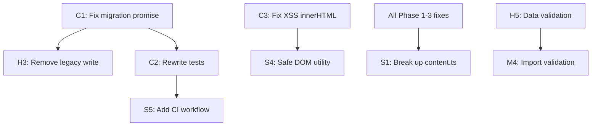

# Audit Fix Implementation Plan

## Dependency Graph

Before diving into phases, here's why items are ordered this way:



> [!IMPORTANT]
> Each phase is independently shippable. Commit and test after every phase before moving on.

---

## Phase 1: Critical Safety Fixes

**Goal:** Stop the bleeding — fix data loss, XSS, and broken tests.  
**Effort:** ~2 hours  
**Risk:** Low (each fix is isolated and small)

---

### 1.1 Fix Migration Fire-and-Forget (C1)

#### [MODIFY] [storage.ts](file:///home/palani/Documents/Gmail-Labels-As-Tabs/src/utils/storage.ts)

**What:** Wrap the inner `chrome.storage.sync.get` callback in a `Promise` so the caller actually waits for migration to complete.

**Current (broken):**
```typescript
// Line 220 — callback is async but no one awaits the inner work
chrome.storage.sync.get(['tabs', 'labels', 'theme', 'showUnreadCount'], async (items) => {
    // ...
    await saveSettings(accountId, newSettings);
});
```

**Target:**
```typescript
export async function migrateLegacySettingsIfNeeded(accountId: string): Promise<void> {
    const key = getAccountKey(accountId);

    const exists = await new Promise<boolean>((resolve) => {
        chrome.storage.sync.get(key, (items) => {
            resolve(!!items[key]);
        });
    });

    if (exists) return;

    // Wrap in Promise so caller actually waits for migration
    return new Promise<void>((resolve, reject) => {
        try {
            chrome.storage.sync.get(['tabs', 'labels', 'theme', 'showUnreadCount'], async (items) => {
                try {
                    if (items.tabs || items.labels) {
                        console.log(`Migrating legacy settings to account: ${accountId}`);
                        let tabs: Tab[] = items.tabs || [];
                        if (items.labels && (!tabs || tabs.length === 0)) {
                            tabs = (items.labels as LegacyTabLabel[]).map(l => ({
                                id: l.id,
                                title: l.displayName || l.name,
                                type: 'label' as const,
                                value: l.name
                            }));
                        }
                        const newSettings: Settings = {
                            tabs,
                            theme: items.theme || 'system',
                            showUnreadCount: items.showUnreadCount !== undefined
                                ? items.showUnreadCount : true
                        };
                        await saveSettings(accountId, newSettings);
                    }
                    resolve();
                } catch (e) {
                    reject(e);
                }
            });
        } catch (e) {
            reject(e);
        }
    });
}
```

---

### 1.2 Fix XSS in Modal `innerHTML` (C3)

#### [MODIFY] [content.ts](file:///home/palani/Documents/Gmail-Labels-As-Tabs/src/content.ts)

**What:** Add an `escapeHtml()` utility and use it everywhere user-controlled strings are interpolated into `innerHTML`.

**Add utility (top of file, after imports):**
```typescript
function escapeHtml(str: string): string {
    const div = document.createElement('div');
    div.textContent = str;
    return div.innerHTML;
}
```

**Apply in these locations:**
- `showPinModal()` (~line 985) — escape any pre-filled values
- `showEditModal()` (~line 1041) — escape `tab.title` and `tab.value` in `innerHTML`
- `showDeleteModal()` (~line 1099) — escape `tab.title` in confirmation text
- `createSettingsModal()` → `refreshList()` (~line 1730) — escape `tab.title` in list items

**Pattern:** Every `${tab.title}` and `${tab.value}` inside template literals used with `innerHTML` becomes `${escapeHtml(tab.title)}` and `${escapeHtml(tab.value)}`.

---

### 1.3 Rewrite Storage Tests (C2)

#### [MODIFY] [storage.test.ts](file:///home/palani/Documents/Gmail-Labels-As-Tabs/test/storage.test.ts)

**What:** Rewrite from scratch to test the current `addTab`/`removeTab`/`getSettings`/`updateTab`/`updateTabOrder` API with per-account storage.

**Key test cases:**
1. `getSettings` returns defaults when no stored settings exist
2. `addTab` adds a tab to the correct account key
3. `addTab` prevents duplicates (same `value`)
4. `removeTab` removes by ID
5. `updateTab` merges partial updates
6. `updateTabOrder` persists new order
7. `migrateLegacySettingsIfNeeded` migrates legacy `labels` format (validates C1 fix)
8. `migrateLegacySettingsIfNeeded` skips if account already exists
9. `saveSettings` merges partial settings correctly

**Mock update:** Replace `mockStorage.labels = []` with per-account key structure: `mockStorage['account_test@gmail.com'] = { tabs: [...] }`.

---

### Phase 1 Verification

```bash
# All tests pass (validates C1 fix + C2 rewrite)
npm test

# Build succeeds (validates C3 escapeHtml doesn't break anything)
npm run build

# Manual spot-check: Load dist/ in Chrome, open Gmail, verify tabs render
```

---

## Phase 2: Stability & Correctness

**Goal:** Eliminate race conditions, dead code, unhandled errors, and add data validation.  
**Effort:** ~1.5 hours  
**Depends on:** Phase 1 complete

---

### 2.1 Add `finalizeInit` Race Guard (C4)

#### [MODIFY] [content.ts](file:///home/palani/Documents/Gmail-Labels-As-Tabs/src/content.ts)

**What:** Add a module-level promise guard to ensure `finalizeInit` is only called once.

```typescript
// Add near line 28, after existing let declarations
let initPromise: Promise<void> | null = null;

// Replace pattern in initializeFromDOM (line 101-103) and loadInboxSDK (line 133-137):
if (!currentUserEmail) {
    currentUserEmail = email;
    initPromise = initPromise || finalizeInit(email);
    await initPromise;
}
```

---

### 2.2 Add `.catch()` to Fire-and-Forget Promises (H1, H6)

#### [MODIFY] [content.ts](file:///home/palani/Documents/Gmail-Labels-As-Tabs/src/content.ts)

**Locations:**
- `handleDrop` (line 493): Change `await updateTabOrder(...)` → add `.catch()` fallback
- `handleGlobalDrop` (line 713): Same pattern
- `exportAllAccounts` (line 1382): Add response callback to `sendMessage`

**Pattern for drag-drop:**
```typescript
updateTabOrder(currentUserEmail, tabs).catch(err => {
    console.warn('Gmail Tabs: Failed to persist tab order', err);
});
```

**Pattern for exportAllAccounts:**
```typescript
chrome.runtime.sendMessage({
    action: 'DOWNLOAD_FILE',
    filename,
    data: json
}, (response) => {
    if (chrome.runtime.lastError) {
        console.warn('Gmail Tabs: Export message failed', chrome.runtime.lastError);
    }
});
```

---

### 2.3 Remove Dead Code (H2, H3, Dead Code Items)

#### [MODIFY] [background.ts](file:///home/palani/Documents/Gmail-Labels-As-Tabs/src/background.ts)

- **Delete** `openOptions` handler (lines 11-12)
- **Delete** `defaultLabels` write block in `onInstalled` (lines 90-97)

#### [MODIFY] [content.ts](file:///home/palani/Documents/Gmail-Labels-As-Tabs/src/content.ts)

- **Delete** `getLabelUrl()` function (lines 1404-1407)
- **Delete** `handleGlobalDragOver()` function (lines 635-671)
- **Delete** `handleGlobalDrop()` function (lines 673-718)
- **Remove** module-level `currentSdk` variable (line 27); use local `sdk` variable captured in `loadInboxSDK` closure at line 141

---

### 2.4 Add Data Validation (H5 + S2)

#### [MODIFY] [storage.ts](file:///home/palani/Documents/Gmail-Labels-As-Tabs/src/utils/storage.ts)

**What:** Add a `validateSettings()` function and call it inside `getSettings()`.

```typescript
function isValidTab(tab: unknown): tab is Tab {
    if (!tab || typeof tab !== 'object') return false;
    const t = tab as Record<string, unknown>;
    return (
        typeof t.id === 'string' &&
        typeof t.title === 'string' &&
        (t.type === 'label' || t.type === 'hash') &&
        typeof t.value === 'string'
    );
}

function validateSettings(raw: unknown): Settings {
    if (!raw || typeof raw !== 'object') return { ...DEFAULT_SETTINGS };
    const obj = raw as Record<string, unknown>;
    return {
        tabs: Array.isArray(obj.tabs)
            ? obj.tabs.filter(isValidTab)
            : [...DEFAULT_SETTINGS.tabs],
        theme: ['system', 'light', 'dark'].includes(obj.theme as string)
            ? (obj.theme as Settings['theme'])
            : 'system',
        showUnreadCount: typeof obj.showUnreadCount === 'boolean'
            ? obj.showUnreadCount
            : true,
    };
}
```

**Apply in `getSettings()`:**
```diff
-const settings = { ...DEFAULT_SETTINGS, ...stored } as Settings;
+const settings = validateSettings(stored);
```

---

### 2.5 Add `return true` to Content Script `onMessage` (M7)

#### [MODIFY] [content.ts](file:///home/palani/Documents/Gmail-Labels-As-Tabs/src/content.ts)

```diff
 chrome.runtime.onMessage.addListener((message, sender, sendResponse) => {
     // ... handlers ...
+    return true;
 });
```

---

### Phase 2 Verification

```bash
# Tests still pass (existing + new from Phase 1)
npm test

# Build succeeds
npm run build

# Manual: Load dist/ in Chrome, open Gmail
# 1. Verify tabs render (no double-init flicker)
# 2. Drag a tab — verify order persists after page reload
# 3. Click extension icon — settings modal opens
```

---

## Phase 3: Performance & Observability

**Goal:** Make the extension faster on Gmail and add CI.  
**Effort:** ~1 hour  
**Depends on:** Phase 2 complete (tests must pass before adding CI)

---

### 3.1 Debounce MutationObserver (H4 + S3)

#### [MODIFY] [content.ts](file:///home/palani/Documents/Gmail-Labels-As-Tabs/src/content.ts)

**What:** Replace direct callback with debounced version in `startObserver()`.

```typescript
let observerDebounceTimer: ReturnType<typeof setTimeout> | null = null;

function startObserver() {
    if (observer) observer.disconnect();
    observer = new MutationObserver(() => {
        if (observerDebounceTimer) return;
        observerDebounceTimer = setTimeout(() => {
            observerDebounceTimer = null;
            attemptInjection();
            updateActiveTab();
        }, 150);
    });
    observer.observe(document.body, { childList: true, subtree: true });
}
```

---

### 3.2 Replace Deprecated `unescape()` (M1)

#### [MODIFY] [background.ts](file:///home/palani/Documents/Gmail-Labels-As-Tabs/src/background.ts)

```diff
-base64Data = btoa(unescape(encodeURIComponent(message.data)));
+const encoder = new TextEncoder();
+const bytes = encoder.encode(message.data);
+let binary = '';
+bytes.forEach(b => binary += String.fromCharCode(b));
+base64Data = btoa(binary);
```

---

### 3.3 Strip Console Logs from Production Build (M3 + S6)

#### [MODIFY] [build.js](file:///home/palani/Documents/Gmail-Labels-As-Tabs/build.js)

```diff
 const commonConfig = {
     // ...existing config...
     minify: true,
+    drop: ['console'],
     logLevel: 'info',
 };
```

> [!NOTE]
> This removes ALL `console.*` calls from the production bundle. During development (`--watch` mode), consider conditionally keeping them by checking `isWatch`.

---

### 3.4 Add Import JSON Schema Validation (M4)

#### [MODIFY] [content.ts](file:///home/palani/Documents/Gmail-Labels-As-Tabs/src/content.ts)

**What:** In `showImportModal()`, validate each tab object after parsing JSON.

Reuse `isValidTab()` from `storage.ts` (export it) to filter invalid entries:

```typescript
import { ..., isValidTab } from './utils/storage';

// In showImportModal's import handler:
const validTabs = data.tabs.filter(isValidTab);
if (validTabs.length === 0) {
    alert('No valid tabs found in the imported file.');
    return;
}
```

---

### 3.5 Remove `@ts-ignore` with Type Augmentation (M2)

#### [NEW] [xhr.d.ts](file:///home/palani/Documents/Gmail-Labels-As-Tabs/src/types/xhr.d.ts)

```typescript
interface XMLHttpRequest {
    _url?: string;
}
```

Then remove `@ts-ignore` from `xhrInterceptor.ts` lines 48, 50, 59, 77.

---

### 3.6 Fix CSS Duplication (M6)

#### [MODIFY] [toolbar.css](file:///home/palani/Documents/Gmail-Labels-As-Tabs/src/ui/toolbar.css)

Remove the duplicate `.tab-drag-handle` block at lines 540-551. Keep the one at lines 422-430 which has the correct `!important` overrides.

---

### 3.7 Add CI Workflow (S5)

#### [NEW] [test.yml](file:///home/palani/Documents/Gmail-Labels-As-Tabs/.github/workflows/test.yml)

```yaml
name: Test & Build
on: [push, pull_request]
jobs:
  test:
    runs-on: ubuntu-latest
    steps:
      - uses: actions/checkout@v4
      - uses: actions/setup-node@v4
        with:
          node-version: '20'
      - run: npm ci
      - run: npm test
      - run: npm run build
```

---

### Phase 3 Verification

```bash
# Tests pass
npm test

# Build succeeds AND console.log stripped from output
npm run build
# Verify: grep for console.log in dist/js/content.js — should find none
grep -c "console.log" dist/js/content.js  # expect 0

# TypeScript compiles without @ts-ignore
npx tsc --noEmit
```

---

## Phase 4: Architecture & Refactoring

**Goal:** Break the monolith, deduplicate code, make the codebase maintainable.  
**Effort:** ~6-8 hours  
**Depends on:** All previous phases complete

> [!WARNING]
> This phase touches nearly every line in `content.ts`. It should be done in a dedicated branch and tested thoroughly before merging.

---

### 4.1 Break Up `content.ts` into Modules (S1)

**Target Structure:**

```
src/
├── content.ts                 → init() + orchestration (~120 lines)
├── utils/
│   ├── storage.ts             → (unchanged)
│   ├── escapeHtml.ts          → escapeHtml() utility
│   └── state.ts               → Shared state (currentSettings, currentUserEmail, etc.)
├── tabs/
│   ├── renderer.ts            → createTabsBar(), renderTabs()
│   ├── navigation.ts          → updateActiveTab(), handleUrlChange()
│   └── dragDrop.ts            → Unified drag-and-drop (single implementation)
├── modals/
│   ├── pinModal.ts            → showPinModal()
│   ├── editModal.ts           → showEditModal()
│   ├── deleteModal.ts         → showDeleteModal()
│   ├── settingsModal.ts       → createSettingsModal(), toggleSettingsModal()
│   ├── importModal.ts         → showImportModal()
│   └── uninstallModal.ts      → showUninstallModal()
├── unread/
│   ├── atomFeed.ts            → Atom feed fetching via fetch()
│   ├── domScraper.ts          → getUnreadCountFromDOM(), normalizeLabel()
│   └── xhrHandler.ts          → handleUnreadUpdates(), buildLabelMapFromDOM()
├── export/
│   └── exportImport.ts        → exportSettings(), exportAllAccounts()
└── theme.ts                   → applyTheme()
```

**Shared state pattern** (`utils/state.ts`):
```typescript
export let currentSettings: Settings | null = null;
export let currentUserEmail: string | null = null;
export function setCurrentSettings(s: Settings) { currentSettings = s; }
export function setCurrentUserEmail(e: string) { currentUserEmail = e; }
```

---

### 4.2 Deduplicate Drag-and-Drop (3 Implementations → 1)

**What:** Currently, drag-and-drop is implemented 3 times:
1. Tab bar drag (lines 420-632) — `handleDragStart/Over/Enter/Leave/Drop/End`
2. Global/smart drag (lines 510-632) — `handleSmartDragOver/Drop`
3. Modal list drag (lines 1628-1715) — `handleModalDragStart/Over/Enter/Leave/Drop/End`

**Target:** Extract a reusable `DragDropManager` class:
```typescript
class DragDropManager {
    constructor(
        private container: HTMLElement,
        private onReorder: (oldIndex: number, newIndex: number) => void
    ) {}
    attach(elements: HTMLElement[]) { /* ... */ }
    detach() { /* ... */ }
}
```

---

### 4.3 Replace Remaining `innerHTML` with Safe DOM (S4)

**What:** After Phase 1's `escapeHtml()` fixes, this step replaces the remaining raw `innerHTML` assignments in all modals with `document.createElement()` + `textContent` calls. This is a thorough rewrite of each modal's DOM construction.

---

### Phase 4 Verification

```bash
# Unit tests pass
npm test

# Build succeeds with new module structure
npm run build

# esbuild should bundle all new modules into single content.js
ls -la dist/js/content.js  # should exist as single bundle

# TypeScript compiles cleanly
npx tsc --noEmit
```

> [!IMPORTANT]
> **Manual testing required after Phase 4.** Load `dist/` in Chrome:
> 1. Open Gmail → verify tab bar renders
> 2. Click a tab → verify navigation works
> 3. Drag a tab → verify reorder works in both tab bar and settings modal
> 4. Open settings → verify theme toggle, unread count toggle
> 5. Export config → verify file downloads
> 6. Import config → verify tabs update
> 7. Verify on a second Gmail account if possible

---

## Phase Summary

| Phase | Items | Effort | Deliverable |
|:------|:------|:-------|:------------|
| **1: Safety** | C1, C2, C3 | ~2 hrs | No data loss, no XSS, tests pass |
| **2: Stability** | C4, H1-H6, M7, dead code | ~1.5 hrs | No races, no dead code, data validation |
| **3: Performance** | H4, M1-M4, M6, S5, S6 | ~1 hr | Debounced observer, CI, clean logs |
| **4: Architecture** | S1, S4, drag dedup | ~6-8 hrs | Modular codebase, single drag impl |
| **Total** | 30 items | **~11-12 hrs** | Production-grade codebase |
